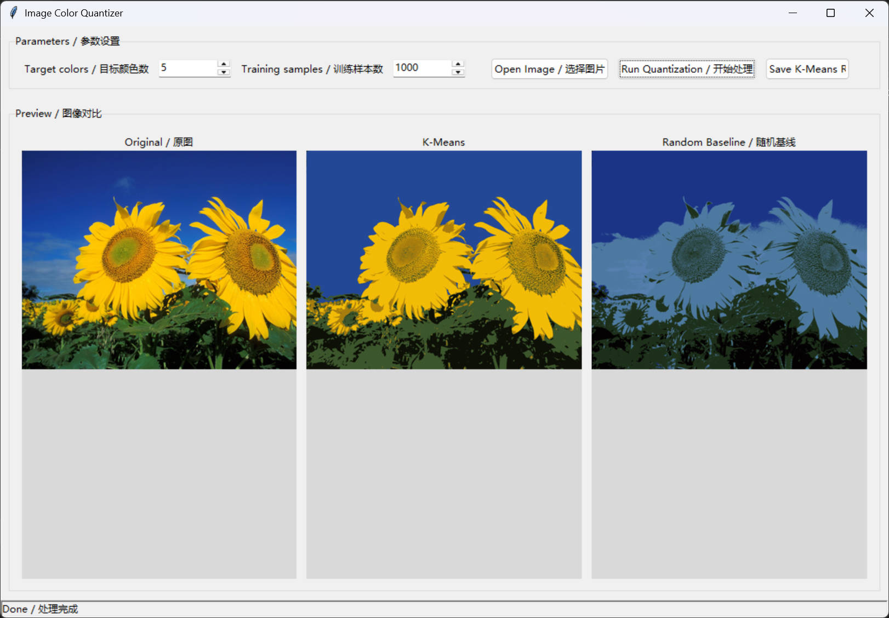

# Color Quantizer GUI

Color Quantizer GUI is a desktop application for image color quantization.
It reduces an image to a limited palette with K-Means, shows a side-by-side comparison,
and lets you export the processed result.

图像颜色量化工具是一个桌面应用程序，用于把图像压缩到较少的颜色数量。
它使用 K-Means 进行颜色量化，提供对比预览，并支持导出处理结果。

In simpler terms, this project can be applied to drawing (processing reference images to better depict binary representations (perhaps?)) and assisting in image processing and other needs.
通俗一点说，该项目可以应用于绘画（处理参考图片，更好的进行二分刻画（或许？）），辅助处理图像等需求。


## Project Overview / 项目简介

- Load common image formats such as `jpg`, `jpeg`, `png`, `bmp`, and `gif`
- Quantize colors with K-Means clustering
- Compare the original image, the K-Means result, and a random baseline
- Save the K-Means output as a new image

- 支持 `jpg`、`jpeg`、`png`、`bmp`、`gif` 等常见图像格式
- 使用 K-Means 聚类进行颜色量化
- 可对比原图、K-Means 结果和随机基线结果
- 可将 K-Means 结果另存为新图像

## Package Contents / 文件内容

- `app/`
  Windows packaged application/Windows 打包应用程序
- `source/`
  Source code and project assets/源代码和项目资源
- `images/`
  Preview image used by this README/本 README 使用的预览图像
- `LICENSE`
  License file/许可证文件


## Run Directly / 直接运行

Open this file:/打开此文件：

```text
app/gui_color_quantizer/gui_color_quantizer.exe
```

Explanation:/说明：

- `gui_color_quantizer.exe` is the program entry point/是程序入口
- `_internal/` is a runtime dependency directory and must be kept in the same directory as the .exe file/是运行时依赖目录，必须和 exe 保持在一起
- Do not move or delete individually/不要单独移动或删除 `_internal/`

## Run From Source / 从源码运行

```bash
cd source
python -m venv .venv
.venv\Scripts\activate
pip install -r requirements.txt
pip install -e .
python -m color_quantizer_gui
```

源码目录包含：

- `src/`
- `assets/`
- `references/`
- `requirements.txt`
- `pyproject.toml`

Example image located at/示例图片位于：

```text
source/assets/examples/example.png
```

## Reference and Attribution / 参考与致谢

This project is inspired by and adapted from the official scikit-learn example:/本项目灵感来源于官方的 scikit-learn 示例并对其进行了改编:

- [Color Quantization using K-Means](https://scikit-learn.org/0.23/auto_examples/cluster/plot_color_quantization.html)

The original demonstration script is preserved in:/原始演示脚本保存在：

```text
source/references/plot_color_quantization_reference.py
```

More precisely:

- The current project keeps the same core quantization idea as the scikit-learn example
- Both implementations use `shuffle(...)` sampling, `KMeans(...)`, `predict(...)`, `pairwise_distances_argmin(...)`, and image reconstruction from palette labels
- The GUI, image loading/saving flow, parameter validation, result packaging, and project structure are custom work in this project

更严谨地说：

- 当前项目保留了与 scikit-learn 官方示例同源的核心量化流程
- 两者都使用了 `shuffle(...)` 抽样、`KMeans(...)` 聚类、`predict(...)` 生成标签、`pairwise_distances_argmin(...)` 生成随机基线，以及根据标签重建图像的思路
- 图形界面、图像载入与保存、参数校验、结果封装和项目结构是本项目自行实现的
